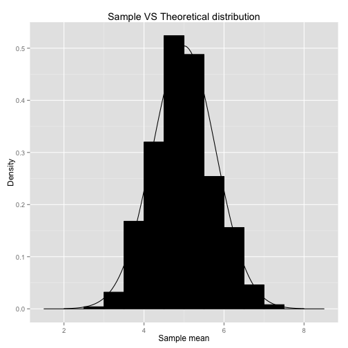

#Overview

Here I am going to analyze the central limit theorem and the exponential distribution in R. I will use the rexp() function to simulate and investigate the exponential distribution. The central limit theorem claims that the distribution of the sample mean is approximately normal when given a sample of large amounts of independant observations. I will show that this is indeed the case given 40 observations.


```r
set.seed(2222)

exp_sample_means <- NULL
for(i in 1:1000) {
  exp_sample_means <- c(exp_sample_means, mean(rexp(40, 0.2)))
}
mean(exp_sample_means)
```

```
## [1] 4.981508
```

```r
var(exp_sample_means)
```

```
## [1] 0.5853779
```

The theoretical mean of the distribution above would be 1/(0.2) = 5 and the actual observed mean is 4.98, which is pretty close
Also, the theoretical variance would be (1/(.2^2)) = .625 as given by the central limit theorem, and the actual observed variance is .585, which is also pretty close.


Here is a plot showing that the distribution of the sample means is about normal


```r
data <- as.data.frame(exp_sample_means)
library(ggplot2)
ggplot(data, aes(x = exp_sample_means)) + 
  geom_histogram(binwidth = 0.5, color = 'black', fill = 'black', aes(y = ..density..)) +
  stat_function(aes(x = c(2, 8)), fun = dnorm, color = 'black', 
                args = list(mean = 5, sd = sqrt(0.625))) +
xlab('Sample mean') +
ylab('Density') +
ggtitle('Sample VS Theoretical distribution')
```

 

#Conclusions

In Conclusion, I did indeed show that the sampling distribution is about normal.
