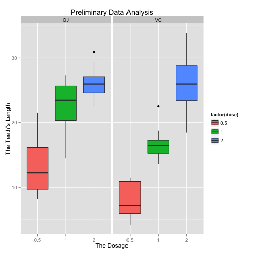

Here I perform some preliminary exploratory data analysis of the data.


```r
library(ggplot2)
library(datasets)
library(knitr)
data(ToothGrowth)
head(ToothGrowth)
```

```
##    len supp dose
## 1  4.2   VC  0.5
## 2 11.5   VC  0.5
## 3  7.3   VC  0.5
## 4  5.8   VC  0.5
## 5  6.4   VC  0.5
## 6 10.0   VC  0.5
```

```r
plot <- ggplot(ToothGrowth, aes(x=factor(dose), y=len,fill=factor(dose)))
plot + geom_boxplot(notch=F) + facet_grid(.~supp) +
     scale_x_discrete("The Dosage") +   
     scale_y_continuous("The Teeth's Length") +  
     ggtitle("Preliminary Data Analysis")
```

 


Here I provide the data's summary


```r
summary(ToothGrowth)
```

```
##       len        supp         dose      
##  Min.   : 4.20   OJ:30   Min.   :0.500  
##  1st Qu.:13.07   VC:30   1st Qu.:0.500  
##  Median :19.25           Median :1.000  
##  Mean   :18.81           Mean   :1.167  
##  3rd Qu.:25.27           3rd Qu.:2.000  
##  Max.   :33.90           Max.   :2.000
```

